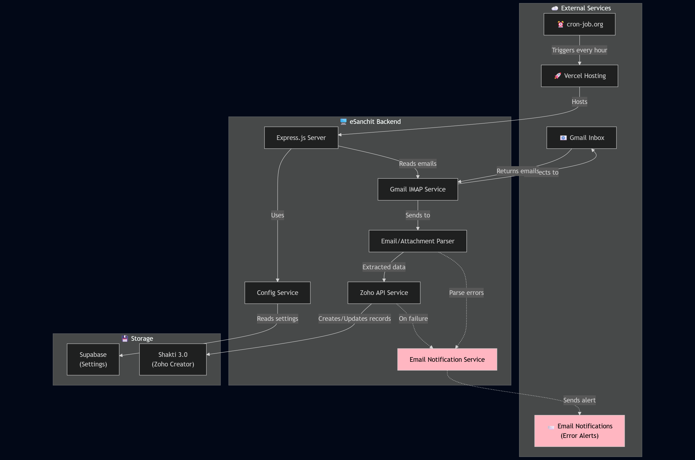
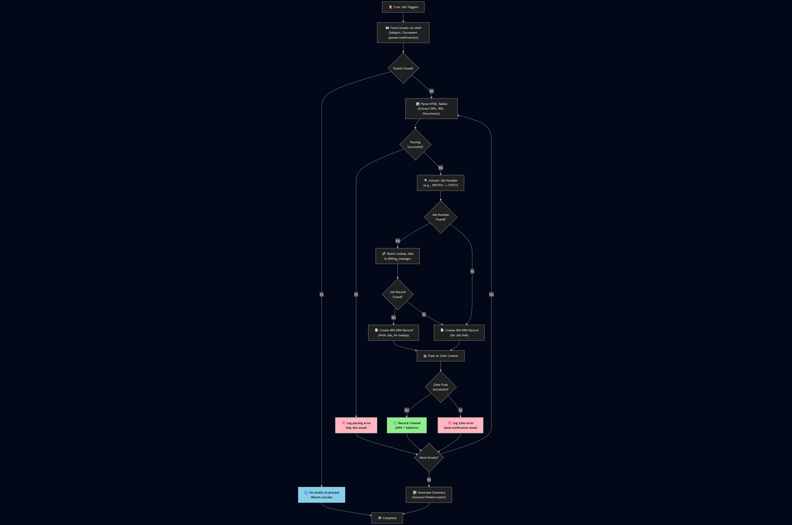
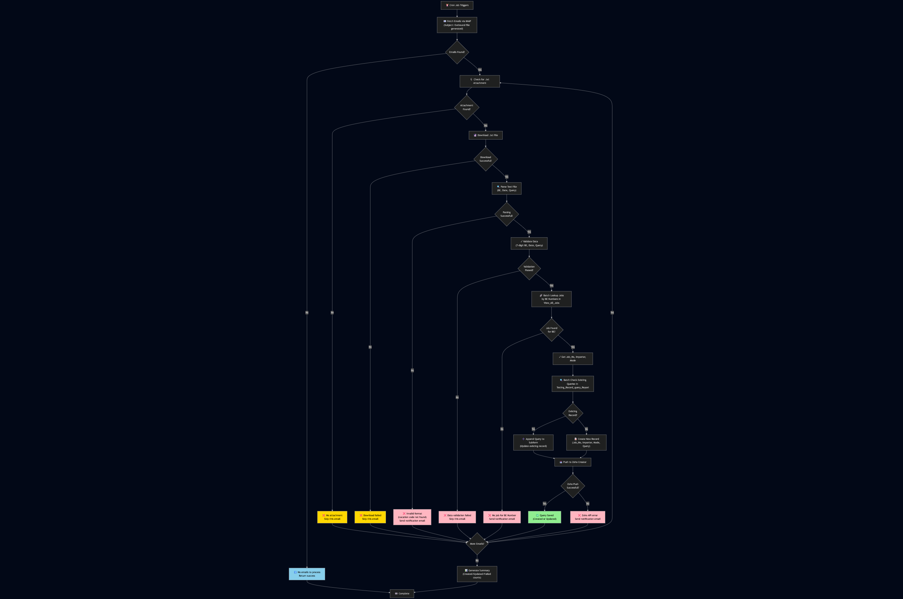
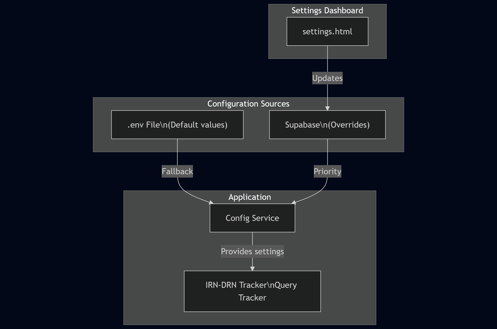

# eSanchit Email Automation System

> **Automated email processing for Import/Export document tracking and customs query management**

This system automatically reads emails related to customs documentation (IRN/DRN) and queries, processes the information, and pushes it to **Shakti 3.0** (our Zoho Creator app) - eliminating manual data entry and ensuring nothing falls through the cracks.

---

## Table of Contents

1. [Problem Statement](#problem-statement)
2. [What This System Does](#what-this-system-does)
3. [Tech Stack](#tech-stack)
4. [How It Works](#how-it-works)
5. [Workflow Diagrams](#workflow-diagrams)
6. [Project Structure](#project-structure)
7. [Configuration](#configuration)
8. [API Endpoints](#api-endpoints)
9. [Deployment & Scheduling](#deployment--scheduling)
10. [Troubleshooting](#troubleshooting)
11. [For Developers](#for-developers)

---

## Problem Statement

### Before This System

| Challenge | Impact |
|-----------|--------|
| **Manual Email Monitoring** | Staff had to constantly check emails for document upload confirmations and customs queries |
| **Data Entry Delays** | Manual copying of IRN/DRN numbers, job details, and query information into Shakti was time-consuming |
| **Missed Queries** | Important customs queries could be overlooked, leading to delays in shipment clearance |
| **No Centralized Tracking** | Difficult to track which documents were uploaded and which queries were pending |
| **Human Errors** | Manual data entry led to typos in critical reference numbers |

### After This System

- **Automatic email monitoring** - System checks for new emails every hour  
- **Instant data extraction** - IRN, DRN, Job Numbers, Queries extracted automatically  
- **Direct Shakti integration** - Data pushed to Zoho Creator without manual entry  
- **Nothing gets missed** - Every email is processed and logged  
- **Error-free** - No more typos in reference numbers  

---

## What This System Does

### Feature 1: IRN-DRN Tracker

**Purpose:** Tracks document uploads to the government eSanchit portal

| What It Captures | Example |
|------------------|---------|
| Job Number | IR51921 |
| DRN (Document Reference Number) | DRN123456789 |
| IRN (Import Reference Number) | IRN987654321 |
| Document Names | Invoice, Packing List, Bill of Lading |

**Email Subject Monitored:** `Document upload confirmation`

**Where Data Goes:** Shakti 3.0 → `IRN_DRN_Tracker` form

**Job Lookup:** Uses `Billing_manager` report to find the Job record by Job Number

#### Raw Email Format Example

The email contains an HTML table that looks like this:

```
DRN : DRN123456789

Document name         | IRN          | Document Type
---------------------|--------------|---------------
IR51921-Invoice.pdf  | IRN987654321 | Invoice
IR51921-Packing.pdf  | IRN987654322 | Packing List
IR51921-BOL.pdf      | IRN987654323 | Bill of Lading
```

**How Data is Extracted:**
1. System parses the HTML table structure
2. Finds the Job ID (IR51921) from document names or email content
3. Extracts DRN from the metadata row
4. For each document row, captures:
   - Document name
   - IRN number
   - Document type

---

### Feature 2: Query Tracker

**Purpose:** Tracks customs department queries for shipments

| What It Captures | Example |
|------------------|---------|
| BE Number (Bill of Entry) | 5937232 |
| Query Date | 03-Dec-2025 |
| Query Text | "IRN FOR BIS PLEASE" |
| Job Details | Importer name, Mode (Air/Sea) |

**Email Subject Monitored:** `Outbound file generated`

**Where Data Goes:** Shakti 3.0 → `Testing_Record_query` form

**Job Lookup Process:**
1. Uses BE Number to search in `View_All_Jobs` report
2. Retrieves: Job_No, Importer, Mode (Air/Sea/Road)
3. Links the query to the correct job

**Existing Queries:** If a job already has queries in `Testing_Record_query_Report`, the system appends new queries rather than creating duplicates

#### Raw Attachment File Example

The email contains a `.txt` file attachment with content like this:

```
FINNSA1593723226112025203122025IRN FOR BIS PLEASE Query Raised By : 10XXXXXX Group: 2H
```

**Format Breakdown:**
```
F INNSA1 5937232 26112025 2 03122025 IRN FOR BIS PLEASE Query Raised By...
│   │      │        │      │   │          │
│   │      │        │      │   │          └─ Query text
│   │      │        │      │   └─ Query Date (DDMMYYYY)
│   │      │        │      └─ Separator (ignored)
│   │      │        └─ First date (ignored) 
│   │      └─ BE Number (7 digits)
│   └─ Location code (INNSA1 = Nhava Sheva)
└─ File type indicator
```

**Supported Location Codes:**
- `INNSA1` - Nhava Sheva
- `INBOM4` - Mumbai
- `INMAA6` - Chennai
- And other customs locations

**How Data is Extracted:**
1. System downloads the `.txt` attachment
2. Normalizes the content (removes delimiters)
3. Finds the location code pattern (e.g., INNSA1)
4. Extracts 7-digit BE Number after location code
5. Extracts 8-digit Query Date (second date in the pattern)
6. Captures query text (everything between date and "Query Raised By")
7. Formats date from `03122025` → `03-Dec-2025`

---

## Shakti 3.0 Forms & Reports Reference

The system integrates with these specific Zoho Creator forms and reports in your Shakti 3.0 app:

### IRN-DRN Tracker

| Type | Name | Purpose |
|------|------|---------|
| **Form** | `IRN_DRN_Tracker` | Stores document upload records with DRN and IRN details |
| **Report (Lookup)** | `Billing_manager` | Used to find existing Job records by Job Number |
| **Subform** | Document details | Stores multiple documents per DRN (name, IRN, type) |

### Query Tracker

| Type | Name | Purpose |
|------|------|---------|
| **Form** | `Testing_Record_query` | Stores customs queries for each job |
| **Report (Check Existing)** | `Testing_Record_query_Report` | Checks if job already has queries |
| **Report (Lookup)** | `View_All_Jobs` | Finds Job by BE Number, gets Importer and Mode |
| **Subform** | `Query_fields` | Stores multiple queries per job (date, query, response) |

**Important:** The form and report names can be changed via the Settings Dashboard without touching code!

---

## Tech Stack

| Component | Technology | Purpose |
|-----------|------------|---------|
| **Backend Server** | Node.js + Express.js | Handles all the processing logic |
| **Email Reading** | Gmail IMAP (with App Password) | Reads emails securely without OAuth complexity |
| **Data Parsing** | node-html-parser, mailparser | Extracts tables from emails and parses attachments |
| **Data Storage** | Zoho Creator (Shakti 3.0) | Where all processed data is stored |
| **Configuration Storage** | Supabase (PostgreSQL) | Stores settings that can be changed via dashboard |
| **Hosting** | Vercel | Runs the server 24/7 in the cloud |
| **Scheduler** | cron-job.org | Triggers the system to run every hour |
|**Error Notifications** | Nodemailer | Sends email alerts when something fails |

---

## How It Works

### Simple Explanation

```
Email arrives in Gmail
        ↓
Cron job triggers every hour
        ↓
System reads new emails
        ↓
Extracts important data (IRN, DRN, Queries)
        ↓
Looks up Job details in Shakti
        ↓
Creates/Updates records in Shakti
        ↓
Done! Data is now in your Zoho app
```

### Detailed Flow

#### IRN-DRN Tracker Flow

1. **Email Received:** eSanchit sends "Document upload confirmation" email with HTML table
2. **Email Fetched:** System reads the email via Gmail IMAP
3. **Data Extracted:** 
   - Parses HTML tables in the email
   - Finds Job Number (e.g., IR51921 → extracts 51921)
   - Finds DRN number from table metadata row
   - Finds IRN numbers for each document
4. **Job Lookup in Zoho:** 
   - Searches `Billing_manager` report for Job_No = 51921
   - Gets the Job record ID (needed to link the DRN record)
5. **Record Created in Zoho:** 
   - Creates entry in `IRN_DRN_Tracker` form
   - **Main fields:** Job_No (lookup), DRN_no
   - **Subform (multiple documents):** For each document:
     - Document_name
     - IRN
     - Document_type

**Example Zoho Record Structure:**
```json
{
  "Job_No": "51921",           // Lookup to Billing_manager
  "DRN_no": "DRN123456789",
  "SubForm": [                 // Multiple rows
    {
      "Document_name": "IR51921-Invoice.pdf",
      "IRN": "IRN987654321",
      "Document_type": "Invoice"
    },
    {
      "Document_name": "IR51921-Packing.pdf",
      "IRN": "IRN987654322",
      "Document_type": "Packing List"
    }
  ]
}
```

#### Query Tracker Flow

1. **Email Received:** "Outbound file generated" email arrives with `.txt` attachment
2. **Attachment Downloaded:** System downloads the text file
3. **Data Parsed:** 
   - Extracts BE Number (Bill of Entry - 7 digits)
   - Extracts Query Date (converts DDMMYYYY → dd-MMM-yyyy)
   - Extracts Query Text (everything before "Query Raised By")
4. **Job Lookup in Zoho:** 
   - Searches `View_All_Jobs` report using BE Number
   - Retrieves: Job_No, Importer, Mode
   - Gets Job record ID
5. **Check for Existing Queries:**
   - Searches `Testing_Record_query_Report` for existing record with this Job
   - If found: Fetches existing subform data (all previous queries)
6. **Query Added:** 
   - **If NEW job:** Creates new record in `Testing_Record_query` form
   - **If EXISTING job:** Updates record, appends new query to subform
   - **Main fields:** Job_No (lookup), Importer, Mode
   - **Subform (multiple queries):** For each query:
     - Query_date
     - Query (text)
     - Response (empty initially)
     - Tags, Keyword (auto-generated)

**Example Zoho Record Structure:**
```json
{
  "Job_No": "51921",           // Lookup to View_All_Jobs
  "Importer": "ABC Industries",
  "Mode": "Sea",
  "Query_fields": [            // Multiple rows (append new queries)
    {
      "Query_date": "03-Dec-2025",
      "Query": "IRN FOR BIS PLEASE",
      "Response": "",
      "Tags": "IRN,BIS",
      "Keyword": "IRN"
    },
    {
      "Query_date": "05-Dec-2025",
      "Query": "PROVIDE CERTIFICATE OF ORIGIN",
      "Response": "",
      "Tags": "Certificate,Origin",
      "Keyword": "Certificate"
    }
  ]
}
```

**Key Difference:** Query tracker APPENDS to existing records, so all queries for a job stay together.

---

## 📊 Workflow Diagrams

> **Note:** These diagrams show the complete workflow including all success and failure paths. The Mermaid source code is available in [`docs/diagrams.md`](docs/diagrams.md) for editing.

### Overall System Architecture



**Key Components:**
- 📧**Gmail IMAP** - Fetches emails securely with App Password
- 🔗**Zoho API** - Batch-optimized lookups and record creation
- 💾**Supabase** - Cloud configuration storage
- 📨**Error Notifications** - Email alerts for failures (shown in pink)

### IRN-DRN Tracker Workflow



**Workflow Highlights:**
- ✅ **Success Path** (Green) - Email parsed → Job lookup → Zoho record created
- ❌ **Error Paths** (Pink) - Parse errors, Zoho failures → Email notifications sent
- ⚠️ **Warnings** (Blue) - No emails found → Graceful exit
- 🔄 **Batch Processing** - Multiple emails processed in one run
- 📊 **Summary** - Success/failure counts logged

### Query Tracker Workflow



**Workflow Highlights:**
- ✅ **Success Path** (Green) - Attachment parsed → BE lookup → Query saved (created or updated)
- ❌ **Critical Errors** (Pink) - Parse errors, Job not found, Zoho failures → Email notifications
- ⚠️ **Skippable Errors** (Yellow) - No attachment, Download failed → Skip and continue
- 🔄 **Batch Optimization** - All BE Number lookups in 1 API call, all Query checks in 1 API call
- ➕ **Smart Appending** - New queries added to existing job records (not duplicates)
- 📨**Error Notifications** - Admin alerted for critical failures only

### Configuration System



**How Configuration Works:**
- 📄**.env File** - Provides default values (deployed with code)
- 💾**Supabase** - Stores overrides (changeable via web UI)
- ⚙️**Priority** - Supabase values override .env defaults
- 🌐**Settings Dashboard** - Update config without redeploying
- 🔄**Live Updates** - Changes take effect on next cron run

---

## 📁 Project Structure

```
esanchit-backend/
│
├── 📄 package.json          # Dependencies and scripts
├── 📄 .env                   # Secret configuration (DO NOT COMMIT)
├── 📄 .env.example           # Template for .env (safe to commit)
├── 📄 config.json            # Static configuration
├── 📄 vercel.json            # Vercel deployment settings
│
├── 📁 public/                # Web interface
│   └── settings.html         # Settings dashboard (accessible via browser)
│
├── 📁 src/                   # Source code
│   │
│   ├── 📄 index.js           # 🚀 MAIN ENTRY POINT - starts the server
│   │
│   ├── 📁 config/            # Configuration loading
│   │   └── index.js          # Loads .env variables
│   │
│   ├── 📁 middleware/        # Request processing
│   │   └── errorHandler.js   # Handles errors gracefully
│   │
│   ├── 📁 routes/            # URL endpoints (what URLs do what)
│   │   ├── index.js          # Combines all routes
│   │   ├── auth.routes.js    # Login/password protection
│   │   ├── config.routes.js  # Settings API
│   │   ├── cron.routes.js    # Cron job endpoints
│   │   ├── irn-drn-tracker/  # IRN-DRN specific routes
│   │   └── record-query/     # Query tracker specific routes
│   │
│   ├── 📁 controllers/       # Business logic (what happens when URL is called)
│   │   ├── auth.controller.js     # Password verification
│   │   ├── config.controller.js   # Settings management
│   │   ├── irn-drn-tracker/       # IRN-DRN processing logic
│   │   │   ├── email.controller.js   # Handles email processing
│   │   │   └── zoho.controller.js    # Handles Zoho data push
│   │   └── record-query/          # Query processing logic
│   │       ├── email.controller.js   # Handles email processing
│   │       └── zoho.controller.js    # Handles Zoho data push
│   │
│   ├── 📁 services/          # Core functionality (reusable code)
│   │   ├── 📁 common/        # Shared services
│   │   │   ├── gmail-imap.service.js  # 📧 Reads Gmail via IMAP
│   │   │   ├── config.service.js      # ⚙️ Manages settings
│   │   │   ├── supabase.service.js    # 💾 Stores settings in cloud
│   │   │   ├── cronjob.service.js     # ⏰ Manages scheduled jobs
│   │   │   ├── 📁 zoho/               # Zoho Creator integration
│   │   │   │   ├── index.js           # Main Zoho service
│   │   │   │   ├── auth.js            # Zoho authentication
│   │   │   │   ├── records.js         # CRUD operations
│   │   │   │   ├── batch-lookup.js    # Efficient bulk searches
│   │   │   │   ├── irn-drn.js         # IRN-DRN specific operations
│   │   │   │   └── record-query.js    # Query specific operations
│   │   │   └── 📁 email-notification/ # Error alert system
│   │   │       ├── service.js         # Sends notification emails
│   │   │       └── templates.js       # Email templates
│   │   ├── 📁 irn-drn-tracker/
│   │   │   └── emailProcessor.service.js  # Processes IRN-DRN emails
│   │   └── 📁 record-query/
│   │       └── emailProcessor.service.js  # Processes Query emails
│   │
│   └── 📁 utils/             # Helper functions
│       ├── 📁 irn-drn-tracker/
│       │   └── htmlTableParser.js    # Extracts data from HTML tables
│       └── 📁 record-query/
│           └── textFileParser.js     # Parses .txt attachments
│
└── 📁 docs/                  # Additional documentation
```

### Key Files Explained

| File | What It Does |
|------|--------------|
| `src/index.js` | Starts the server, sets up all routes |
| `src/services/common/gmail-imap.service.js` | Connects to Gmail and fetches emails |
| `src/services/common/zoho/index.js` | All Zoho Creator API operations |
| `src/services/irn-drn-tracker/emailProcessor.service.js` | Main logic for IRN-DRN processing |
| `src/services/record-query/emailProcessor.service.js` | Main logic for Query processing |
| `src/utils/irn-drn-tracker/htmlTableParser.js` | Extracts tables from email HTML |
| `src/utils/record-query/textFileParser.js` | Parses query text files |
| `public/settings.html` | Web dashboard to change settings |

---

## Configuration

### Environment Variables (.env)

Create a `.env` file based on `.env.example`. Here are the key settings:

#### Server Settings
```env
PORT=3000
NODE_ENV=development
```

#### Gmail IMAP (Email Reading)
```env
GMAIL_USER=your-email@gmail.com
GMAIL_APP_PASSWORD=xxxx xxxx xxxx xxxx   # 16-character app password from Google
```

#### Zoho Creator (Data Storage)
```env
ZOHO_CLIENT_ID=your_client_id
ZOHO_CLIENT_SECRET=your_client_secret
ZOHO_REFRESH_TOKEN=your_refresh_token
ZOHO_ACCOUNT_OWNER=nisarg@nagarkot.co.in
ZOHO_APP_LINK_NAME=shakti-3-0
```

#### IRN-DRN Tracker Settings
```env
EMAIL_SUBJECT_KEYWORDS=Document upload confirmation
ZOHO_FORM_LINK_NAME=IRN_DRN_Tracker
ZOHO_JOB_REPORT_LINK_NAME=Billing_manager
```

#### Query Tracker Settings
```env
RECORD_QUERY_SUBJECT_KEYWORD=Outbound file generated
RECORD_QUERY_FORM_LINK_NAME=Testing_Record_query
RECORD_QUERY_REPORT_LINK_NAME=Testing_Record_query_Report
RECORD_QUERY_JOB_REPORT_LINK_NAME=View_All_Jobs
```

#### Supabase (Settings Storage)
```env
SUPABASE_URL=https://your-project.supabase.co
SUPABASE_ANON_KEY=your_anon_key
```

#### Security
```env
SETTINGS_PASSWORD=your_secure_password
CRON_SECRET=your_random_secret
```

### Using the Settings Dashboard

1. Open: `https://mailtozoho.vercel.app/settings.html`
2. Enter the settings password
3. Modify any configuration
4. Changes are saved to Supabase and take effect immediately

---

## 🌐 API Endpoints

### Health Checks
| Method | Endpoint | Description |
|--------|----------|-------------|
| GET | `/api/health` | Check if server is running |
| GET | `/api/irn-drn-tracker/health` | IRN-DRN service health |
| GET | `/api/record-query/health` | Query service health |

### Manual Processing
| Method | Endpoint | Description |
|--------|----------|-------------|
| POST | `/api/irn-drn-tracker/process` | Manually trigger IRN-DRN processing |
| POST | `/api/record-query/process` | Manually trigger Query processing |

### Cron Endpoints (Used by cron-job.org)
| Method | Endpoint | Description |
|--------|----------|-------------|
| POST | `/api/cron/irn-drn-tracker` | Scheduled IRN-DRN processing |
| POST | `/api/cron/record-query` | Scheduled Query processing |

### Settings Management
| Method | Endpoint | Description |
|--------|----------|-------------|
| GET | `/api/config/settings` | Get current settings |
| POST | `/api/config/settings` | Update settings |
| GET | `/api/config/cron/status` | Check cron job status |

---

## 🔌 Making Custom API Calls

You can customize how the system processes emails using API parameters. This is useful for:
- **One-time manual processing** of older emails
- **Testing** with specific parameters
- **Custom workflows** with different search criteria

### IRN-DRN Tracker - Custom Parameters

#### Available Parameters

| Parameter | Type | Default | Description |
|-----------|------|---------|-------------|
| `hoursBack` | Number | 3 | How many hours to look back for emails |
| `maxResults` | Number | 20 | Maximum number of emails to process |
| `pushToZoho` | Boolean | true | Whether to push data to Zoho Creator |
| `subjectKeywords` | String/Array | "Document upload confirmation" | Email subject to search for |

#### Example API Calls

**PowerShell:**
```powershell
# Process last 12 hours of emails
$body = @{
    hoursBack = 12
    maxResults = 50
    pushToZoho = $true
} | ConvertTo-Json

Invoke-RestMethod -Uri "https://mailtozoho.vercel.app/api/irn-drn-tracker/process" `
    -Method POST `
    -Body $body `
    -ContentType "application/json"
```

**cURL:**
```bash
# Process last 24 hours without pushing to Zoho (testing)
curl -X POST https://mailtozoho.vercel.app/api/irn-drn-tracker/process \
  -H "Content-Type: application/json" \
  -d '{
    "hoursBack": 24,
    "maxResults": 100,
    "pushToZoho": false
  }'
```

**JavaScript/Fetch:**
```javascript
// Process with custom subject keywords
const response = await fetch('https://mailtozoho.vercel.app/api/irn-drn-tracker/process', {
  method: 'POST',
  headers: { 'Content-Type': 'application/json' },
  body: JSON.stringify({
    hoursBack: 6,
    maxResults: 30,
    pushToZoho: true,
    subjectKeywords: ['Document upload', 'Upload confirmed']
  })
});

const result = await response.json();
console.log(result);
```

---

### Query Tracker - Custom Parameters

#### Available Parameters

| Parameter | Type | Default | Description |
|-----------|------|---------|-------------|
| `hoursBack` | Number | 3 | How many hours to look back for emails |
| `maxResults` | Number | 30 | Maximum number of emails to process |
| `pushToZoho` | Boolean | true | Whether to push data to Zoho Creator |

**Note:** Subject keyword and form names are controlled via Settings Dashboard, not request parameters.

#### Example API Calls

**PowerShell:**
```powershell
# Process last 6 hours of query emails
$body = @{
    hoursBack = 6
    maxResults = 50
    pushToZoho = $true
} | ConvertTo-Json

Invoke-RestMethod -Uri "https://mailtozoho.vercel.app/api/record-query/process" `
    -Method POST `
    -Body $body `
    -ContentType "application/json"
```

**cURL:**
```bash
# Dry run - parse emails but don't push to Zoho
curl -X POST https://mailtozoho.vercel.app/api/record-query/process \
  -H "Content-Type: application/json" \
  -d '{
    "hoursBack": 12,
    "maxResults": 100,
    "pushToZoho": false
  }'
```

---

### Response Format

Both endpoints return a JSON response with this structure:

```json
{
  "success": true,
  "message": "Processed 5 email(s)",
  "data": {
    "parsed": {
      "success": true,
      "emailsProcessed": 5,
      "results": [...]
    },
    "zoho": {
      "totalRecords": 5,
      "successCount": 5,
      "failedCount": 0,
      "results": [...]
    }
  }
}
```

---

## 📊 Zoho API Call Optimization

The system is optimized to minimize Zoho API usage through **batch processing**.

### IRN-DRN Tracker - API Calls Per Run

| Step | API Calls | Notes |
|------|-----------|-------|
| **Batch Job Lookup** | 1 | Looks up all Job Numbers in one call |
| **Fallback Individual Lookup** | 0-N | Only if batch fails (rare) |
| **Create Records** | N | One call per email (unavoidable) |

**Example:** Processing 10 emails = **~11 API calls** (1 batch lookup + 10 creates)

**Without batch optimization:** Same 10 emails = **~20 API calls** (10 individual lookups + 10 creates)

**Savings:** ~45% reduction in API usage!

---

### Query Tracker - API Calls Per Run

| Step | API Calls | Notes |
|------|-----------|-------|
| **Batch BE Number Lookup** | 1 | Finds all Jobs by BE Numbers in View_All_Jobs |
| **Batch Record Query Lookup** | 1 | Checks which Jobs already have query records |
| **Create/Update Records** | N | One call per unique job |

**Example:** Processing 10 query emails for 5 different jobs:
- **With batch optimization:** 2 batch lookups + 5 creates/updates = **7 API calls**
- **Without batch:** 10 job lookups + 10 query checks + 5 creates/updates = **25 API calls**

**Savings:** ~72% reduction in API usage!

---

### Typical Hourly Usage

Based on typical email volume:

| Tracker | Emails/Hour | API Calls | Monthly Estimate* |
|---------|-------------|-----------|-------------------|
| IRN-DRN | 2-5 | ~6 | ~4,320 |
| Query | 5-10 | ~8 | ~5,760 |
| **Total** | **7-15** | **~14/hour** | **~10,080/month** |

*Assumes 24/7 operation. Actual usage may be lower during off-hours.

**Zoho Creator API Limits:**
- Free tier: 1,000 calls/day
- Standard tier: 10,000 calls/day
- Premium tier: 25,000 calls/day

**Our system comfortably fits within Standard tier limits** (~350 calls/day average).

---

### Testing Without Zoho API Usage

To test email parsing without consuming Zoho API calls:

```powershell
# Test IRN-DRN parsing only
Invoke-RestMethod -Uri "https://mailtozoho.vercel.app/api/irn-drn-tracker/process" `
    -Method POST `
    -Body '{"pushToZoho": false}' `
    -ContentType "application/json"

# Test Query parsing only
Invoke-RestMethod -Uri "https://mailtozoho.vercel.app/api/record-query/process" `
    -Method POST `
    -Body '{"pushToZoho": false}' `
    -ContentType "application/json"
```

This will fetch and parse emails but skip the Zoho Creator integration.

---

## Deployment & Scheduling

### Vercel Deployment

The app is deployed on Vercel. Any push to the main branch auto-deploys.

**Live URL:** `https://mailtozoho.vercel.app`

### Cron Job Setup (cron-job.org)

Two cron jobs are configured:

| Job | URL | Schedule | Purpose |
|-----|-----|----------|---------|
| IRN-DRN Tracker | `POST /api/cron/irn-drn-tracker` | Every hour | Process document upload emails |
| Query Tracker | `POST /api/cron/record-query` | Every hour | Process query emails |

**Important:** Each cron job must include the `x-cron-secret` header matching your `CRON_SECRET` environment variable.

---

## Common Use Cases

Here are practical examples for common scenarios:

### Scenario 1: Backfill Missing Data

If the system was down for a few hours and you need to process missed emails:

```powershell
# Process last 12 hours of IRN-DRN emails
Invoke-RestMethod -Uri "https://mailtozoho.vercel.app/api/irn-drn-tracker/process" `
    -Method POST `
    -Body '{"hoursBack": 12, "maxResults": 100}' `
    -ContentType "application/json"

# Process last 12 hours of query emails
Invoke-RestMethod -Uri "https://mailtozoho.vercel.app/api/record-query/process" `
    -Method POST `
    -Body '{"hoursBack": 12, "maxResults": 100}' `
    -ContentType "application/json"
```

---

### Scenario 2: Emergency Catch-Up (System Down for a Day)

```powershell
# Process last 24 hours in batches to avoid timeout
# Batch 1: Last 6 hours
Invoke-RestMethod -Uri "https://mailtozoho.vercel.app/api/irn-drn-tracker/process" `
    -Method POST `
    -Body '{"hoursBack": 6, "maxResults": 50}' `
    -ContentType "application/json"

# Wait a bit, then batch 2: 6-12 hours ago
Start-Sleep -Seconds 30
# ... continue with more batches
```

---

### Scenario 3: Testing Before Going Live

```powershell
# Test without pushing to Zoho (dry run)
$testResult = Invoke-RestMethod -Uri "https://mailtozoho.vercel.app/api/irn-drn-tracker/process" `
    -Method POST `
    -Body '{"hoursBack": 1, "maxResults": 5, "pushToZoho": false}' `
    -ContentType "application/json"

# Check what would be pushed
Write-Host "Emails found: $($testResult.data.parsed.emailsProcessed)"
Write-Host "Documents extracted: $($testResult.data.parsed.totalDocuments)"
```

---

### Scenario 4: Process Specific Subject Lines

```powershell
# IRN-DRN with custom subject
Invoke-RestMethod -Uri "https://mailtozoho.vercel.app/api/irn-drn-tracker/process" `
    -Method POST `
    -Body '{"subjectKeywords": ["Upload confirmed", "Document loaded"]}' `
    -ContentType "application/json"
```

---

### Scenario 5: Monitor API Usage

```powershell
# Get current config to see API usage settings
$config = Invoke-RestMethod -Uri "https://mailtozoho.vercel.app/api/config/settings" `
    -Method GET

Write-Host "Checking every $($config.data.IRN_DRN_INTERVAL_HOURS) hours"
Write-Host "Max emails per run: $($config.data.EMAIL_MAX_RESULTS)"
```

---

## Troubleshooting

### Common Issues

| Problem | Solution |
|---------|----------|
| **Emails not being fetched** | Check Gmail App Password is correct. Ensure IMAP is enabled in Gmail settings. |
| **Zoho push failing** | Verify Zoho refresh token hasn't expired. Check API quota. |
| **Cron jobs timing out** | Reduce `EMAIL_MAX_RESULTS` in settings. Make sure `EMAIL_HOURS_BACK` isn't too large. |
| **Settings not saving** | Check Supabase URL and anon key are correct. |
| **Job lookup failing** | Ensure the Job exists in Shakti before the email is processed. |

### Checking Logs

1. **Vercel Dashboard:** Go to your Vercel project → Deployments → Click latest → View logs
2. **Local Development:** Logs appear in your terminal when running `npm run dev`

### Error Notifications

When the system encounters an error, it sends an email to addresses configured in `ERROR_NOTIFICATION_EMAILS`.

---

## 👨‍💻 For Developers

### Local Development

```bash
# Install dependencies
npm install

# Copy environment template
cp .env.example .env
# Edit .env with your credentials

# Start development server
npm run dev

# Server runs at http://localhost:3000
```

### Adding a New Feature

1. **New Email Type?**
   - Create folder in `src/controllers/your-feature/`
   - Create folder in `src/services/your-feature/`
   - Create parser in `src/utils/your-feature/`
   - Add routes in `src/routes/your-feature/`

2. **New Zoho Form?**
   - Add methods to `src/services/common/zoho/`
   - Create a new module file for domain-specific operations

3. **New Configuration?**
   - Add to `src/services/common/config.service.js` → `getConfigurableKeys()`
   - Add default value in `.env.example`

### Code Architecture Principles

- **Separation of Concerns:** Routes → Controllers → Services → Utils
- **Feature-based Organization:** Each tracker has its own folder
- **Shared Services:** Common code (Gmail, Zoho) is in `services/common/`
- **Configuration Priority:** Supabase overrides → .env defaults

### Testing Locally

```bash
# Test IRN-DRN processing
curl -X POST http://localhost:3000/api/irn-drn-tracker/process

# Test Query processing
curl -X POST http://localhost:3000/api/record-query/process

# Check health
curl http://localhost:3000/api/health
```

---

## 📞 Support

For issues or questions, contact the development team.

---

## 📜 License

ISC

---

*Last updated: December 2025*


