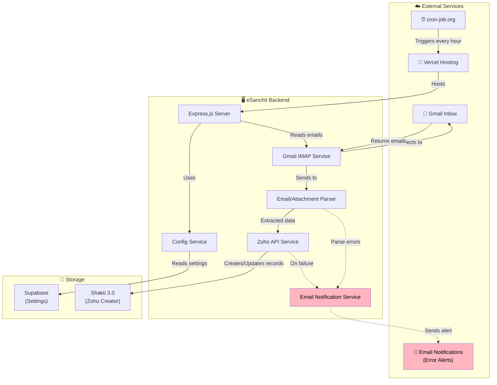
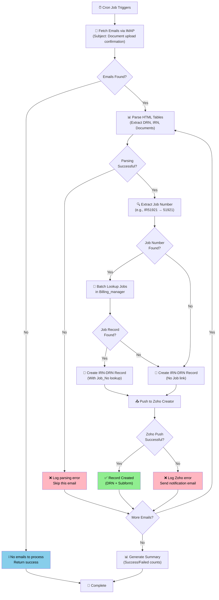
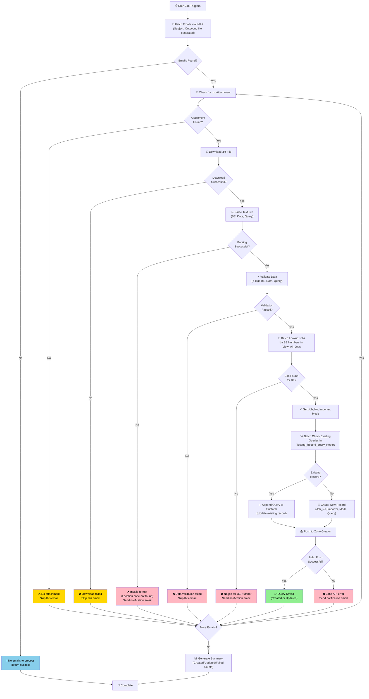
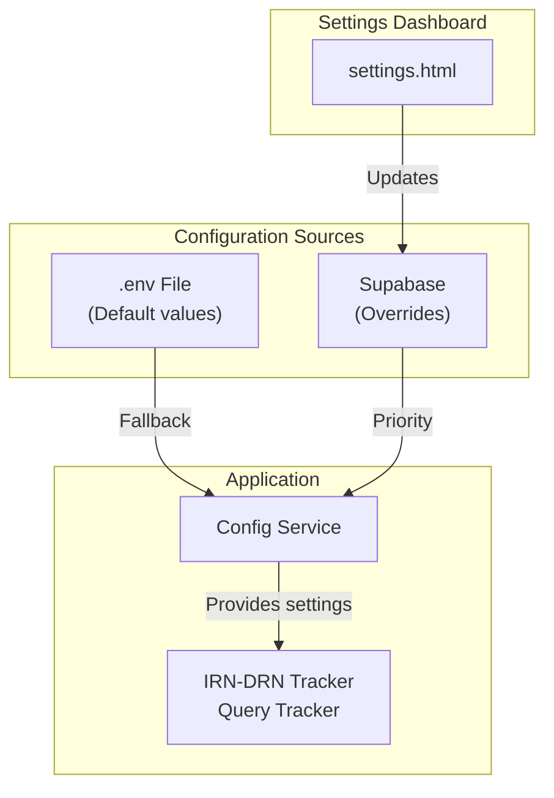

# Workflow Diagrams - Mermaid Source Code

This file contains the Mermaid source code for all workflow diagrams used in the main README.

**To edit diagrams:**
1. Copy the Mermaid code below
2. Paste into [Mermaid Live Editor](https://mermaid.live/)
3. Make your changes
4. Export as PNG (or SVG)
5. Save to `docs/images/` folder
6. Update README if needed

---

## 1. Overall System Architecture

**File:** `system-architecture.png`

---

## 2. IRN-DRN Tracker Workflow

**File:** `irn-drn-workflow.png`

---

## 3. Query Tracker Workflow

**File:** `query-workflow.png`

---

## 4. Configuration System

**File:** `config-system.png`

---

## Color Legend

| Color | Hex Code | Purpose |
|-------|----------|---------|
| 🟢 Green | `#90EE90` | Success states |
| 🔴 Pink | `#FFB6C1` | Critical errors (notifications sent) |
| 🟡 Yellow | `#FFD700` | Warnings (skippable errors) |
| 🔵 Blue | `#87CEEB` | Information (no action needed) |

All text in colored boxes uses `color:#000` (black) for better readability.
